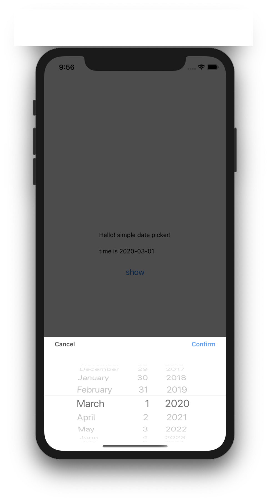
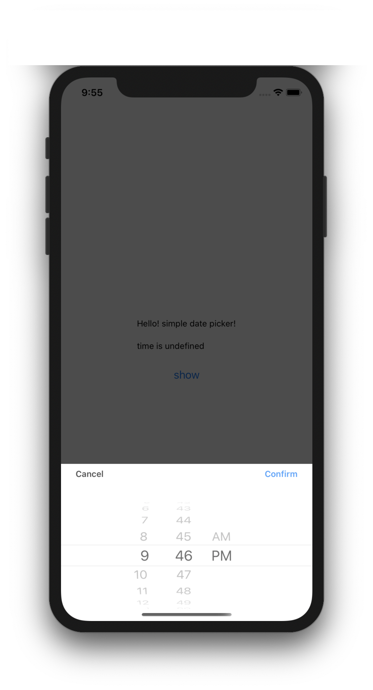
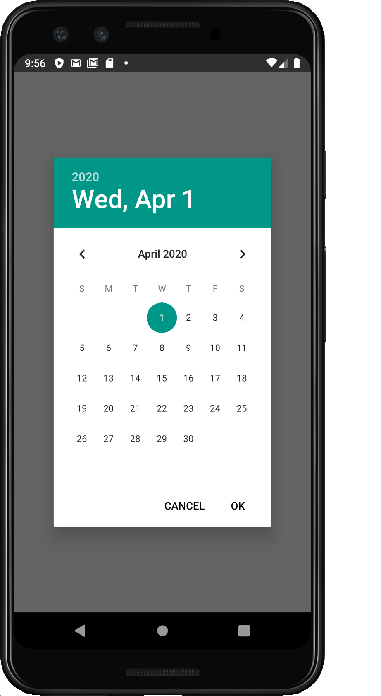
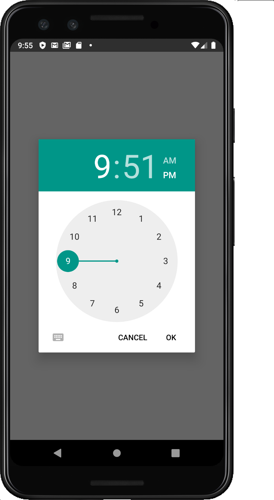

# react-native-datepicker

React Native simple date & time picker component for iOS and Android, using @react-native-community/datetimepicker

<table>
  <tr><td colspan=2><strong>iOS</strong></td></tr>
  <tr>
    <td><p align="center"></p></td>
    <td><p align="center"></p></td>
  </tr>
  <tr><td colspan=2><strong>Android</strong></td></tr>
  <tr>
    <td><p align="center"></p></td>
    <td><p align="center"></p></td>
  </tr>
</table>

## install

> IMPORTANT - **At first, you have to install [@react-native-community/datetimepicker](https://github.com/react-native-community/datetimepicker) as a peer dependecy, and [link it](https://github.com/react-native-community/datetimepicker#getting-started)**

```bash
npm install --save simple-react-native-datepicker
```

## General Usage

```js
import React, { Component } from 'react';
import { View, SafeAreaView, Text, Button } from 'react-native';
import DateTimePicker from 'simple-react-native-datepicker'

interface IState {
	visible: boolean;
	dateStr?: string;
	date?: Date;
}

class App extends Component<{}, IState> {
  constructor(props: {}) {
    super(props);
    this.state = { dateStr: '', date: new Date(), visible: false };
  }
  public render() {
    return (
      <SafeAreaView style={{ flex: 1, alignItems: 'center', justifyContent: 'center' }}>
        <View>
          <Text style={{ marginBottom: 20 }}>Hello! simple date picker!</Text>
          <Text style={{ marginBottom: 20 }}>time is {String(this.state.dateStr)}</Text>
          <Button onPress={() => this.showDatePicker()} title="show" />
          <DatePciker
            visible={this.state.visible}
            onDateChange={(dateStr, date) => this.onDateChange(dateStr, date)}
            date={this.state.date}
          />
        </View>
      </SafeAreaView>
    );
  }

  public showDatePicker() {
    this.setState({ visible: true });
  }

  public onDateChange(dateStr?: string, date?: Date) {
    if (dateStr === undefined) {
      dateStr = 'canceled';
    }
    this.setState({ dateStr, date, visible: false });
  }
}

export default App;

```

## Props

#### `visible` (`required`)

Defines show or hide the picker.

```js
<RNDateTimePicker visible={true} />

<RNDateTimePicker visible={this.state.isShowDatePicker} />
```

### `format`(`optional`)

Defines date string format. Please refer to [moment format](https://momentjs.com/docs/#/parsing/string-format/)

```js
<RNDateTimePicker mode="date" format="YYYY-MM-DD" />
```

#### `mode` (`optional`)

Defines the type of the picker.

List of possible values:

- `"date"` (default for `iOS` and `Android`)
- `"time"`
- `"datetime"` (`iOS` only)
- `"countdown"` (`iOS` only)

```js
<RNDateTimePicker mode="time" />
```

#### `display` (`optional`, `Android only`)

Defines the visual display of the picker for Android and will be ignored for iOS.

List of possible values:

- `"default"`
- `"spinner"`
- `"calendar"` (only for `date` mode)
- `"clock"` (only for `time` mode)

```js
<RNDateTimePicker display="spinner" />
```

#### `onDateChange` (`required`)

Date change handler.

This is called when the user changes the date or time in the UI. It receives the formatted dateStr and the date as parameters.

If dateStr and date receives undefined, it mean's datepicker canceled like press cacel button.

```js
setDate = (dateStr, date) => {
	if (dateStr === undefined && date === undefined) {
		// cancel handler execute
	}
};

<RNDateTimePicker onChange={this.setDate} />;
```

#### `date` (`optional`)

Defines the date or time value used in the component.

```js
<RNDateTimePicker date={new Date()} />
```

#### `maximumDate` (`optional`)

Defines the maximum date that can be selected.

```js
<RNDateTimePicker maximumDate={new Date(2300, 10, 20)} />
```

#### `minimumDate` (`optional`)

Defines the minimum date that can be selected.

```js
<RNDateTimePicker minimumDate={new Date(1950, 0, 1)} />
```

#### `timeZoneOffsetInMinutes` (`optional`, `iOS only`)

Allows changing of the timeZone of the date picker. By default it uses the device's time zone.

```js
// GMT+1
<RNDateTimePicker timeZoneOffsetInMinutes={60} />
```

#### `textColor` (`optional`, `iOS only`)

Allows changing of the textColor of the date picker.

```js
<RNDateTimePicker textColor="red" />
```

#### `locale` (`optional`, `iOS only`)

Allows changing of the locale of the component. By default it uses the device's locale.
Please refer to [here](https://gist.github.com/jacobbubu/1836273)

```js
<RNDateTimePicker locale="es-ES" />
```

#### `is24Hour` (`optional`, `Android only`)

Allows changing of the time picker to a 24 hour format.

```js
<RNDateTimePicker is24Hour={true} />
```

#### `minuteInterval` (`optional`, `iOS only`)

The interval at which minutes can be selected.
Possible values are: `1, 2, 3, 4, 5, 6, 10, 12, 15, 20, 30`

```js
<RNDateTimePicker minuteInterval={10} />
```

### `confirmText`(`optional`, `iOS only`) default = "Confirm"

Defines iOS datepicker confirm button title

```js
<RNDateTimePicker confirmText="확인" />
```

### `cancelText`(`optional`, `iOS only`) default = "Cancel"

Defines iOS datepicker cancel button title

```js
<RNDateTimePicker confirmText="취소" />
```

### `confirmTextStyle`(`optional`, `iOS only`)

Defines iOS datepicker confirm button title style

```js
<RNDateTimePicker confirmTextStyle={{ color: 'red' }} />
```

### `cancelTextStyle`(`optional`, `iOS only`)

Defines iOS datepicker cancel button title style

```js
<RNDateTimePicker cancelTextStyle={{ color: 'black' }} />
```

## Running the example app

1. Install required pods in `demo/ios` by running `pods install`
1. Run `npm start` to start Metro Bundler
1. Run `npm run start ios` or `npm run start android`
